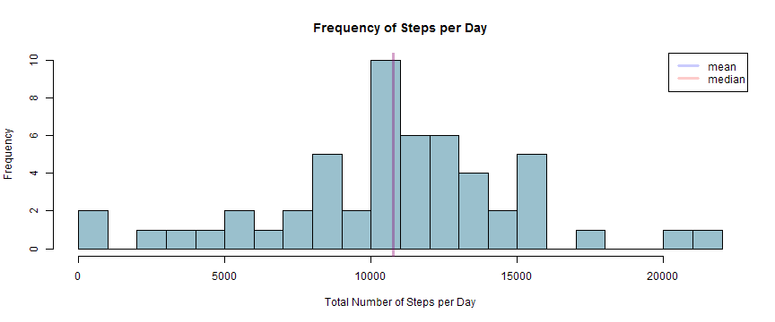
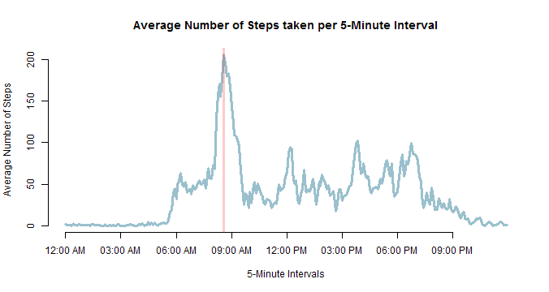
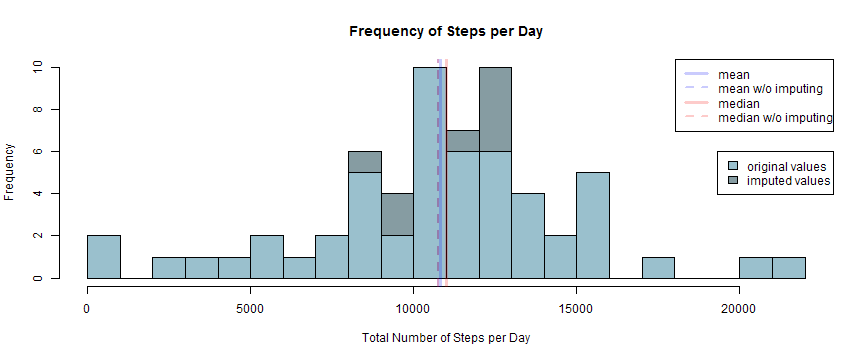
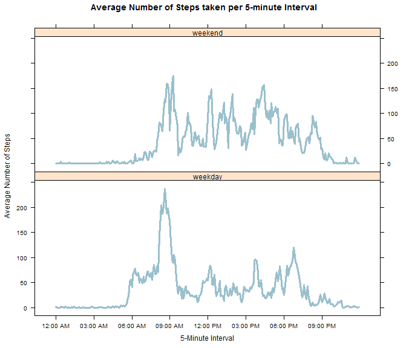

# Peer Assessment 1
| **Course**:  | [Reproducible Research](https://class.coursera.org/repdata-004/) |
|--------------|------------------------------------------------------------------|
| **Student**: | McReyar                                                          |
| **Date**:    | 07/12/2014                               |

```r
# load necessary libraries
library(scales)
library(data.table)
library(xtable)
library(lattice)
```


## Loading and preprocessing the data
If the ZIP-file is not stored in the current directory, it has to be downloaded:

```r
## Download zip if necessary
if(!file.exists("activity.zip")) {
    download.file("http://d396qusza40orc.cloudfront.net/repdata%2Fdata%2Factivity.zip"
                 ,destfile = "activity.zip")
    paste("downloaded:", format(Sys.time(),"%m/%d/%Y %I:%M %p %Z", tz = "UTC"))
}
```

```
## [1] "downloaded: 07/12/2014 10:48 AM UTC"
```

The data has to be unzipped and read:

```r
# unzip and load data
activity <- data.table(read.csv(unz("activity.zip","activity.csv")
                               ,colClasses = c("integer","Date","integer"))
                      )
print(xtable(summary(activity))
     ,type = "html", include.rownames = FALSE
     )
```

<!-- html table generated in R 3.0.2 by xtable 1.7-3 package -->
<!-- Sat Jul 12 12:48:44 2014 -->
<TABLE border=1>
<TR> <TH>     steps </TH> <TH>      date </TH> <TH>    interval </TH>  </TR>
  <TR> <TD> Min.   :  0.0   </TD> <TD> Min.   :2012-10-01   </TD> <TD> Min.   :   0   </TD> </TR>
  <TR> <TD> 1st Qu.:  0.0   </TD> <TD> 1st Qu.:2012-10-16   </TD> <TD> 1st Qu.: 589   </TD> </TR>
  <TR> <TD> Median :  0.0   </TD> <TD> Median :2012-10-31   </TD> <TD> Median :1178   </TD> </TR>
  <TR> <TD> Mean   : 37.4   </TD> <TD> Mean   :2012-10-31   </TD> <TD> Mean   :1178   </TD> </TR>
  <TR> <TD> 3rd Qu.: 12.0   </TD> <TD> 3rd Qu.:2012-11-15   </TD> <TD> 3rd Qu.:1766   </TD> </TR>
  <TR> <TD> Max.   :806.0   </TD> <TD> Max.   :2012-11-30   </TD> <TD> Max.   :2355   </TD> </TR>
  <TR> <TD> NA's   :2304   </TD> <TD>  </TD> <TD>  </TD> </TR>
   </TABLE>

As the values of interval range from 0 to 2355 and 100 follows on 55, it seems reasonable to convert the interval to time-format:

```r
activity$time <- with(activity
                     ,as.POSIXct((interval %/% 100 * -40 + interval) * 60
                                ,origin = "1960-01-01", tz = "UTC")
                     )
```

## What is mean total number of steps taken per day?

```r
# aggregate activity by day and calculate sum of steps
daySteps <- activity[!is.na(activity$steps)
                    ,list(sum  = sum(steps))
                    ,by = date]
# create histogram
hist(daySteps$sum, col = "lightblue3", breaks = 20
    ,main = "Frequency of Steps per Day"
    ,xlab = "Total Number of Steps per Day"
    )
# add vertical lines for mean and median
meanSteps   <- mean(  daySteps$sum)
medianSteps <- median(daySteps$sum)
abline(v = meanSteps,   col = alpha("blue", 0.2), lwd = 3)
abline(v = medianSteps, col = alpha("red" , 0.2), lwd = 3)
# add legend for mean and median-lines
legend("topright", lwd = 3
      ,legend = c("mean", "median")
      ,col    = c(alpha("blue", 0.2), alpha("red", 0.2))
      )
```

 

The mean number of steps taken per day is 10766 and the median is 10765 - they overlap in the histogram because they are so close together.

## What is the average daily activity pattern?

```r
# aggregate activity by interval/time and calculate average steps
intervalSteps <- activity[!is.na(activity$steps)
                         ,list(mean = mean(steps))
                         ,by = time]
# create times-series plot
with(intervalSteps, plot(time, mean, col = "lightblue3", type = 'l', lwd = 3
                       ,main = "Average Number of Steps taken per 5-Minute Interval"
                       ,xlab = "5-Minute Intervals"
                       ,ylab = "Average Number of Steps"
                       ,xaxt = "n"
                       ,bty  = "n"
                       )
    )
# create x-axis with correct time format
axis.POSIXct(1, at = seq(min(intervalSteps$time)
                        ,max(intervalSteps$time), by = "3 hour")
            ,format = "%I:%M %p")
# add line for maximum
maxSteps <- intervalSteps$time[which.max(intervalSteps$mean)]
abline(v = maxSteps, col = alpha("red", 0.2), lwd = 3)
```

 

As highlighted by the red vertical line, activity peaks at the 08:35-interval (206 steps in 5 minutes).

## Imputing missing values
There are serveral days, where all values are missing:

```r
# missing values per day and total missing values
print(
    xtable(t(addmargins(
                table(
                    format(activity$date[is.na(activity$steps)]
                          ,format = "%m/%d"
                    )
           )))
       ,digits = 0
    )
    ,include.rownames = FALSE, type = "html"
)
```

<!-- html table generated in R 3.0.2 by xtable 1.7-3 package -->
<!-- Sat Jul 12 12:48:45 2014 -->
<TABLE border=1>
<TR> <TH> 10/01 </TH> <TH> 10/08 </TH> <TH> 11/01 </TH> <TH> 11/04 </TH> <TH> 11/09 </TH> <TH> 11/10 </TH> <TH> 11/14 </TH> <TH> 11/30 </TH> <TH> Sum </TH>  </TR>
  <TR> <TD align="right"> 288 </TD> <TD align="right"> 288 </TD> <TD align="right"> 288 </TD> <TD align="right"> 288 </TD> <TD align="right"> 288 </TD> <TD align="right"> 288 </TD> <TD align="right"> 288 </TD> <TD align="right"> 288 </TD> <TD align="right"> 2304 </TD> </TR>
   </TABLE>

Therefore using the average of the same day to impute the missing values is not possible. To still account for different activity patterns for different days, the average steps for the same weekday and the same interval is taken to account for missing values:

```r
imputed <- activity
# add weekday
imputed$weekday <- as.POSIXlt(imputed$date)[["wday"]]
# aggregate by interval/time and weekday and calculate average steps
avgSteps <- imputed[,list(mean = mean(steps,  na.rm = TRUE))
                    ,by = list(time, weekday)]
# add mean per time and weekday to activity-data
imputed <- merge(imputed, avgSteps, by = c("time", "weekday"), all.x = TRUE)
# use the mean per time and weekday for missing values
imputed$steps[is.na(imputed$steps)] <- imputed$mean[is.na(imputed$steps)]
```

This has an impact on the histogram (the additional frequencies are shown in darker blue):

```r
# aggregate imputed activity data by day and calculate sum
dayStepsImp <- imputed[,list(sum = sum(steps)), by = date]
# create histogram
hist(dayStepsImp$sum, col = alpha("lightblue4", 0.8), breaks = 20
    ,main = "Frequency of Steps per Day"
    ,xlab = "Total Number of Steps per Day"
    )
# add barsizes based on data before imputation
hist(daySteps$sum, col = "lightblue3", breaks = 20
    ,add = TRUE
    )
# add vertical lines for mean and median (before and after imputation)
abline(v = meanSteps,      col = alpha("blue" ,0.2), lwd = 2, lty = 2)
abline(v = medianSteps,    col = alpha("red"  ,0.2), lwd = 2, lty = 2)
meanStepsImp   <- mean  (dayStepsImp$sum)
medianStepsImp <- median(dayStepsImp$sum)
abline(v = meanStepsImp,   col = alpha("blue" ,0.2), lwd = 3)
abline(v = medianStepsImp, col = alpha("red"  ,0.2), lwd = 3)
# add legend for mean and median-lines
legend("topright", lwd = c(3, 2, 3, 2), lty = c(1, 2, 1, 2)
      ,legend = c("mean", "mean w/o imputing", "median", "median w/o imputing")
      ,col    = rep(c(alpha("blue", 0.2), alpha("red", 0.2)), each = 2)
      )
# add legend for original / imputed values
legend("right"
      ,legend = c("original values", "imputed values")
      ,fill   = c("lightblue3", alpha("lightblue4", 0.8))
      )
```

 

As indicated in the histogram, the imputation results in a slight increase of the average steps per day (from 10766 to 10821) as well as the median steps per day (from 10765 to 11015).

## Are there differences in activity patterns between weekdays and weekends?

```r
# add factor-variable for weekend/weekday
imputed$day <- as.factor(ifelse(imputed$weekday %in% c(0,6), "weekend", "weekday"))
# aggregate by new factor variable and time/interval
weekday <- imputed[,list(mean  = mean(steps)), by = list(day,time)]
# create panel plot
xyplot(mean ~ time | day
      ,data = weekday
      ,layout = c(1,2)
      ,type = "l", lwd = 3, col = "lightblue3"
      ,main = "Average Number of Steps taken per 5-minute Interval"
      ,xlab = "5-Minute Interval"
      ,scales = list(x = list(at = seq(min(weekday$time)
                                      ,to = max(weekday$time)
                                      ,by = "3 hour")
                             ,format = "%I:%M %p"
                             )
                  )
      ,ylab = "Average Number of Steps"
      ,panel = function(x, y, ...) {
           panel.xyplot(x, y, ...)
       })
```

 

On weekends the peak at 08:35 isn't as pronounced and the activity has more variance over the whole day.
